# 🛡️ LogSentinel.AI

> **"The Virtual L3 Support Engineer That Never Sleeps."**


---

## � System Architecture


---

## 🚀 The AIOps Revolution

Traditional monitoring tools (Seq, Kibana) only show **what** happened.
**LogSentinel.AI** explains **why** it happened and **how** to fix it.

It is an intelligent background agent that:

1.  **Watches** your application logs in real-time.
2.  **Detects** anomalies and critical errors.
3.  **Analyzes** stack traces using Generative AI (Google Gemini, GPT-4o, or Llama 3).

4.  **Prescribes** a fix (SQL optimization, code patch, or config change).
5.  **Alerts** your team via Discord/Slack with a "Root Cause Analysis" report.

---

## 🧠 Architecture: Hexagonal & Intelligent

We follow a strict **Hexagonal Architecture (Ports & Adapters)** to decouple the AI Core from inputs and outputs.

### **The Core (Domain)**

- **LogAnalysisOrchestrator**: Manages the flow and implements **Debouncing** (deduplication of alerts).
- **Entities**: `LogEntry`, `AnalysisResult`.

### **Adapters (Infrastructure)**

- **Inputs**:
  - `FileLogWatcher`: Tails local log files in real-time.
  - _(Future)_ `SeqLogProvider`: Polls Seq API for distributed logs.
- **AI Backend**:
  - **Microsoft Semantic Kernel**: The orchestration engine.
  - **Google Gemini Adapter**: Powerful and cost-effective analysis (Gemini 1.5 Pro/Flash).
  - **OpenAI Adapter**: Uses GPT-4o for maximum intelligence.
  - **Ollama Adapter**: Uses local models (Llama 3) for **Privacy Mode**.

- **Outputs**:
  - `DiscordAlertDispatcher`: Sends beautiful, rich-embed alerts.
  - `EmailAlertDispatcher`: Sends detailed HTML reports to executives.

---

## 🎨 Visualizing the Flow

```mermaid
sequenceDiagram
    participant App as Application
    participant Watcher as LogSentinel (Input Port)
    participant Core as Orchestrator (Domain)
    participant AI as Semantic Kernel (LLM)
    participant Alert as Discord (Output Port)

    App->>Watcher: Writes Error Log
    Watcher->>Core: Streams LogEntry

    activate Core
    Core->>Core: Check Debounce Cache
    alt Is Duplicate?
        Core-->>Watcher: Ignore (Throttled)
    else Is New Issue?
        Core->>AI: Analyze(Stack Trace)
        activate AI
        AI->>AI: "Think" (Root Cause + Fix)
        AI-->>Core: AnalysisResult JSON
        deactivate AI

        Core->>Alert: SendAlert(Log + Fix)
        Alert-->>User: 🚨 Notification received
    end
    deactivate Core
```




---

## 🌐 Flexible AI Providers (Gemini / OpenAI / Ollama)

You can switch between AI providers instantly by changing `appsettings.json`.

### **Option 1: Google Gemini (Recommended)**

```json
"AI": {
  "Provider": "Gemini",
  "ApiKey": "YOUR_GEMINI_KEY_HERE",
  "ModelId": "gemini-2.5-flash"
}
```

### **Option 2: Privacy Mode (Ollama)**

Data privacy is paramount. LogSentinel supports **Local LLMs** out of the box.
By changing one setting, your logs **never leave your infrastructure**.

```json
"AI": {
  "Provider": "Ollama",
  "Endpoint": "http://localhost:11434/v1/",
  "ModelId": "llama3"
}
```

---

## 🛠️ Getting Started

1.  **Configure**: Edit `src/LogSentinel.Worker/appsettings.json`.
2.  **Run**:
    ```bash
    dotnet run --project src/LogSentinel.Worker
    ```
3.  **Simulate**:
    The worker creates a `app_logs.txt`. Write a line to it:
    ```text
    2024-02-17T12:00:00Z|Error|CheckoutService|NullReferenceException in CalculateTax|at CheckoutService.cs:line 42
    ```
4.  **Watch**: See the AI analyze and alert you on Discord!

---

_Architected with ❤️ by Emirhan Uluksar._
